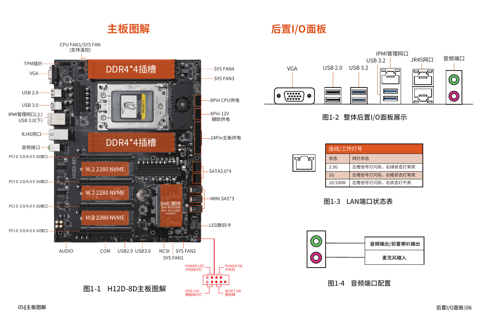
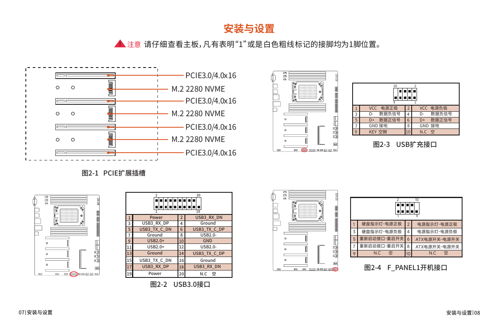
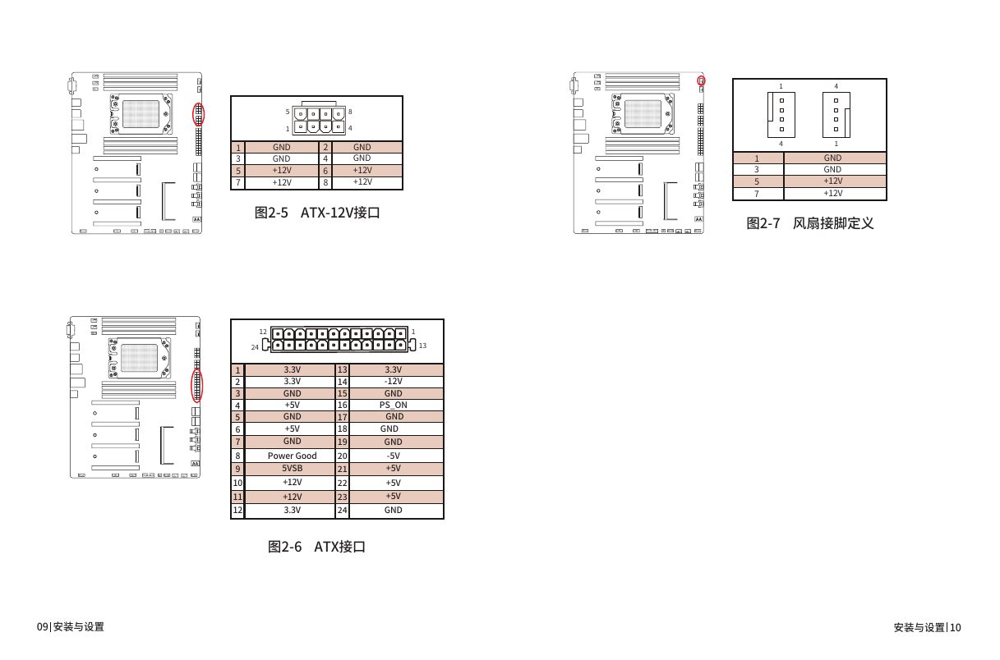

# Huananzhi H12D-8D Hardware Reference

## Overview

The **Huananzhi H12D-8D** (华南金牌 H12D-8D, Ver2.0) is a **single-socket** AMD EPYC ATX server mainboard released in early 2025. It targets high-performance computing, data center, workstation, and AI workloads.

> ⚠️ Despite the "D" in H12**D**, this board has only **one** CPU socket (not dual-socket).

| Attribute           | Value                                      |
|---------------------|--------------------------------------------|
| Form factor         | ATX, 305 × 245 mm                          |
| PCB layers          | 14-layer                                   |
| CPU socket          | 1× AMD SP3                                 |
| Supported CPUs      | EPYC 7002 (Rome, Zen2), EPYC 7003 (Milan, Zen3) |
| **Not** supported   | EPYC 7001 (Naples), EPYC 9004 (Genoa, SP5), EPYC 8004 (Siena, SP6) |
| Memory slots        | 8× DDR4 ECC RDIMM / LRDIMM                |
| Memory channels     | 8-channel (octa-channel)                   |
| Memory speeds       | 2133 / 2400 / 2666 / 2933 / 3200 MT/s     |
| Max RAM             | Up to 2 TB                                 |
| BIOS                | AMI UEFI                                   |
| OS support          | Windows, Linux                             |
| Approx. price (CN)  | ¥2188 (no BMC) / ¥2388 (with BMC module)   |

## Board Diagrams

All diagrams are rendered from the official Huananzhi H12D-8D bilingual manual (Chinese primary).

### Board Overview & Rear I/O



*图1-1 H12D-8D主板图解 — full board layout with all headers, slots, and connectors labeled. 图1-2 整体后置I/O面板展示 — rear I/O bracket. 图1-3 LAN端口状态表 — link LED meanings for the Intel I226-V 2.5 GbE ports.*

### Connector & Header Pinouts



*图2-1 PCIE扩展插槽 — slot arrangement (alternating PCIe x16 / M.2 2280). 图2-2 USB3.0接口 — 19-pin USB 3.2 front-panel header. 图2-3 USB扩充接口 — 9-pin USB 2.0 header. 图2-4 F_PANEL1开机接口 — 10-pin front-panel power/reset/LED header.*

### Power & Fan Pinouts



*图2-5 ATX-12V接口 — 8-pin CPU power (both required). 图2-6 ATX接口 — 24-pin main ATX power. 图2-7 风扇接脚定义 — fan header pinout: Pin1=GND, Pin2=+12V, Pin3=Tach, Pin4=PWM.*

## Memory Slot Numbering

Slots are **labeled MM1–MM8** on the board silkscreen. All 8 slots serve the single CPU.

| Slot | Channel | Notes                               |
|------|---------|-------------------------------------|
| MM1  | A       | **First slot — install here first** |
| MM2  | B       |                                     |
| MM3  | C       |                                     |
| MM4  | D       |                                     |
| MM5  | E       |                                     |
| MM6  | F       |                                     |
| MM7  | G       |                                     |
| MM8  | H       |                                     |

**MM1 is the first slot** on this board.

## DIMM Population Rules

Spread DIMMs across channels before doubling up in any channel.

| DIMMs installed | Recommended slots         |
|-----------------|---------------------------|
| 1               | MM1                       |
| 2               | MM1, MM5                  |
| 4               | MM1, MM3, MM5, MM7        |
| 8 (full/optimal)| MM1–MM8                   |

- Use identical DIMMs (capacity, speed, rank) for best compatibility.
- 8 DIMMs gives maximum bandwidth via true 8-channel interleaving.

> 💡 **Live example (confirmed):** A system with 2× 32 GB DDR4 ECC @ 3200 MT/s in MM1 and MM5 reported 64 GB total in BIOS (Chipset → Socket 0 Information), confirming this population order.

> 📝 **BIOS internal naming:** The AMD CBS memory configuration shows channels as **Channel 0–Channel 7** (0-indexed), corresponding to silkscreen labels MM1–MM8 (A–H). The CBS memory submenu also shows "Socket 0" and "Socket 1" entries — these represent the two halves of the single CPU's memory controller (4 channels each), **not** two physical CPU sockets.

## Expansion Slots & Storage

### PCIe & M.2
- 4× PCIe 4.0 x16 slots
- 3× M.2 2280 NVMe (PCIe 4.0 x4 each)

### PCIe Slot Power Control — EPYC 7282 (Rome) vs Intel Haswell-EP

Unlike Intel Haswell-EP (e.g., MRA9) where CPU IIO root ports have `SltCap: HotPlug- PwrCtrl-` **permanently hardwired in silicon**, AMD EPYC 7282 (Rome) root ports are **firmware-configurable** — the CPU itself is capable of advertising `HotPlug+/PwrCtrl+`.

However, the full chain must be implemented:
1. **Board must wire PCIe power-switch lines** (SMBus/GPIO-attached power controllers per slot)
2. **ACPI firmware must expose `_PR3`/`_PS3` methods** for each root port
3. **BIOS must set `HotPlug+/PwrCtrl+`** bits in the root port config registers

The Huananzhi H12D-8D is a budget server board — it is **unlikely** to have slot power-switch hardware wired up. Verify with:
```bash
lspci -vvv | grep -A3 "Root Port" | grep SltCap
```
If you see `PwrCtrl-`, software-controlled PCIe slot power cycling is not possible regardless of EPYC's CPU-level capability. Check `/sys/bus/pci/slots/*/power` — the file will only exist if `PwrCtrl+` is set.

> **Contrast with MRA9:** On MRA9 (Haswell-EP), `PwrCtrl-` is a read-only silicon register the BIOS can never change. On H12D-8D (EPYC Rome), if Huananzhi had wired the hardware, `PwrCtrl+` could work — but this has not been confirmed.

### Onboard SATA
- 4× SATA3 (6 Gbps) ports directly on the board

### SFF-8643 (Mini-SAS HD) — Dual-Mode
- 3× SFF-8643 ports — each port operates in **one** of two modes (configure via BIOS):
  - **SATA mode:** each SFF-8643 breaks out into 4× SATA3 ports → up to **12 additional SATA ports** total
  - **U.2 mode:** each port provides 1× PCIe 4.0 x4 NVMe → up to **3× U.2 NVMe drives** total
  - ⚠️ Cannot mix SATA and U.2 modes simultaneously on the same SFF-8643 port.

## Power

| Connector        | Details                                 |
|------------------|-----------------------------------------|
| 24-pin ATX       | Main board power                        |
| 2× 8-pin EPS     | CPU power (both required under load)    |
| VRM              | 9+5 phase, 60 A DrMOS per phase         |

## Networking

| Interface              | Chip                  | Notes                              |
|------------------------|-----------------------|------------------------------------|
| 2× RJ45 (2.5 GbE)      | Intel I226-V          | Main data network                  |
| 1× RJ45 (100 MbE)      | Realtek RTL8201F      | Dedicated IPMI/BMC management port |

## Rear I/O

- 4× USB 3.2 Gen1 Type-A
- 2× USB 2.0 Type-A
- 2× RJ45 (Intel I226-V 2.5 GbE)
- 1× RJ45 (IPMI/BMC management, Realtek RTL8201F)
- 1× VGA (only active when AST2500 BMC module is installed)
- 1× 2-hole audio jack (USB digital audio via CJC6811A SoC)
- 1× I/O shield (included)

## Internal Headers

| Header            | Connector         | Function                              |
|-------------------|-------------------|---------------------------------------|
| F_PANEL1 (JFP1)   | 10-pin (2×5, pin 2 = KEY) | Power SW, Reset SW, Power LED, HDD LED |
| USB 3.2 Gen1      | 19-pin            | Front panel USB 3.x                   |
| USB 2.0           | 9-pin             | Front panel USB 2.0                   |
| Audio             | Standard          | Front panel audio                     |
| COM               | Serial header     | COM port                              |
| SMBUS             | —                 | System Management Bus                 |
| NCSI              | —                 | Network Controller Sideband Interface |
| TPM2.0            | —                 | Hardware TPM module                   |
| PMBus             | —                 | Power Management Bus                  |
| MB BIOS           | —                 | BIOS flash/recovery header            |
| DE_BUG            | —                 | Onboard POST code debug display       |
| System Restart    | —                 | System restart header                 |

### F_PANEL1 (JFP1) Pinout — Confirmed from Manual (Figure 2-4)

10-pin 2×5 header; **pin 2 is KEY (no contact)**. Physical layout: 2 rows of 5, odd pins on left.

```
Left (odd)          Right (even)
Pin 1: HDD LED+     Pin 2: KEY (no contact)
Pin 3: HDD LED-     Pin 4: PWR LED-
Pin 5: RESET SW     Pin 6: ATX PWR SW
Pin 7: RESET SW     Pin 8: ATX PWR SW
Pin 9: N.C          Pin 10: PWR LED+
```

**Wiring summary:**
| Function    | Pins          | Notes                        |
|-------------|---------------|------------------------------|
| HDD LED     | 1 (+), 3 (−)  | Polarity matters for LED     |
| PWR LED     | 10 (+), 4 (−) | Polarity matters for LED     |
| RESET SW    | 5, 7          | Polarity irrelevant (switch) |
| **ATX PWR SW** | **6, 8**   | **Polarity irrelevant (switch)** |

> ⚠️ The ATX PWR SW (pins 6+8) is tied to **host power state** — shorting it toggles the system power on/off. It is **not suitable** for per-GPU power control (switching it off powers down the entire host).

> 📝 The English translation of the manual has jumbled pin numbering; the Chinese-language version (Figure 2-4) is authoritative.

## Cooling & Fan Headers

- 6× fan headers total:
  - 1× **CPU_FAN1** — PWM, BIOS-controlled
  - 5× **SYS_FAN1–SYS_FAN5** — PWM, can be BMC-controlled when BMC module installed
- Fan curves configurable via AMI UEFI BIOS; SYS fans can be managed remotely via IPMI (requires BMC module).

## Audio

- **SoC:** Guanghua Xin (光华芯) **CJC6811A** USB digital audio codec
- Connected to rear 2-hole audio jack and internal audio header

## BMC / IPMI Management

- **BMC module:** ASPEED **AST2500** — sold **separately** (not included by default)
- Installing the BMC module enables:
  - IPMI 2.0 remote management
  - VGA output on rear I/O
  - Remote KVM, power control, sensor monitoring
  - BMC-based SYS_FAN management
- IPMI 2.0 compliant when BMC is installed

## BIOS

- **Type:** AMI UEFI
- **CPU support:** EPYC 7002 (Rome) native; EPYC 7003 (Milan) may require BIOS update — check Huananzhi product page
- **BIOS Version (confirmed):** 2.0 — Build Date **06/13/2025**
- **AMI UEFI Core:** Version **2.20.1275**
- **Menu tabs:** Main | Advanced | Chipset | Security | Boot | Save & Exit | **AMD CBS** | AMD PBS Option | Event Logs
- **CSM:** Disabled by default — pure UEFI, no legacy BIOS boot
- **Configuration options include:** CPU cores, virtualization (SVM), memory channels/speeds, fan curves, NVMe/SATA boot priority, PCIe mode for SFF-8643, IPMI settings
- **BIOS update tutorial:** https://www.youtube.com/watch?v=nCq0WRROdS8
- **BIOS download:** http://www.huananzhi.com/en/list_6/183.html

### PSP / Firmware Versions (confirmed with EPYC 7282 + BIOS 2.0)

| Component | Level 1 (Fixed) | Level 2 (Updateable) |
|---|---|---|
| PSP Recovery BL Ver | FF.C.0.89 | — |
| PSP BootLoader Version | — | 0.C.0.89 |
| SMU FW Version | 0.36.118.0 | 0.36.118.0 |
| ABL Version | 34242010 | 34242010 |

### BIOS Default Settings (confirmed)

| Setting | Default | Location |
|---|---|---|
| SVM (virtualization) | Enabled | Advanced → CPU Configuration |
| Above 4G Decoding | Enabled | Advanced → PCI Bus Driver |
| SR-IOV Support | Enabled | Advanced → PCI Bus Driver |
| Re-Size BAR Support | Enabled | Advanced → PCI Bus Driver |
| PCI Bus Driver Version | A5.01.19 | Advanced → PCI Bus Driver |
| CSM Support | Disabled | Advanced → CSM |
| Restore On AC Power Loss | Last State | Advanced → ACPI Settings |
| Wake On LAN | Enabled | Advanced → ACPI Settings |
| RTC Wakeup | Disabled | Advanced → ACPI Settings |
| Core Performance Boost | Auto | AMD CBS → CPU Common Options |
| Global C-state Control | Enabled | AMD CBS → CPU Common Options |
| NUMA nodes per socket | NPS1 | AMD CBS → Memory Addressing |
| DRAM ECC | Enabled | Advanced → Memory Configuration |
| IOMMU | Enabled | AMD CBS → NBIO Common Options |
| ACS Enable | Enabled | AMD CBS → NBIO Common Options |
| SRIS | Disabled | AMD CBS → NBIO Common Options |
| TPM / Security Device | Enabled | Advanced → Trusted Computing |
| NVDIMM-N Feature | Active (not disabled) | AMD CBS → NVDIMM |

> 📝 The board **does support NVDIMM-N** (persistent memory) via the "Disable NVDIMM-N Feature: No" default.

## Verified Compatible Hardware

### CPUs Confirmed Working

| CPU | Cores/Threads | Base Clock | Family | Microcode |
|---|---|---|---|---|
| **AMD EPYC 7282** | 16C / 32T | 2800 MHz | 17h (Zen2/Rome) | 830107B |

**EPYC 7282 Details (from live BIOS readout):**
- Processor Family: **17h**, Model: **30h–3Fh** (Zen 2 / Rome)
- Running @ **2800 MHz, 1100 mV**
- L1 Instruction Cache: 32 KB/8-way per core
- L1 Data Cache: 32 KB/8-way per core
- L2 Cache: 512 KB/8-way per core
- L3 Cache per Socket: **64 MB/16-way**
- SEV + SEV-ES supported

### Memory Confirmed Working

| Part Number | Manufacturer | Type | Capacity | Speed | Config | Total RAM |
|---|---|---|---|---|---|---|
| HMAA8GL7MMR4N-UH TE | SK Hynix | DDR4 LRDIMM ECC | 64 GB | **PC4-2400T** (2400 MT/s) | 8× (all slots, MM1–MM8) | **512 GB** |
| (unknown Samsung) | Samsung | DDR4 RDIMM ECC | 32 GB | 3200 MT/s | 2× (MM1 + MM5) | 64 GB |

**SK Hynix HMAA8GL7MMR4N-UH TE — Part Number Decode:**

| Field | Value | Meaning |
|---|---|---|
| HMA | HMA | SK Hynix DDR4 DRAM |
| A | A | Die revision A |
| 8G | 8G | 8 Gbit per die |
| L | L | **LRDIMM** (Load Reduced DIMM) |
| 7 | 7 | x4 ECC organization |
| MMR4N | MMR4N | DDR4, Registered/LR, non-parity |
| UH | UH | **PC4-2400T** speed bin (2400 MT/s) |
| TE | TE | Temperature/bin suffix |

**Current configuration (8× HMAA8GL7MMR4N-UH TE):**
- All 8 slots populated (MM1–MM8) → **full 8-channel mode**
- Total capacity: 8 × 64 GB = **512 GB**
- Speed: **PC4-2400T (2400 MT/s)**
- Type: **LRDIMM ECC** — all 8 channels active

## Package Contents

- 1× H12D-8D motherboard
- 2× SATA cables
- 1× I/O shield
- 1× User manual
- *(BMC/IPMI module sold separately)*

## Known Quirks and Limitations

- ⚠️ **Single-socket:** Despite the "D" in H12**D**, only one SP3 CPU socket is present.
- ⚠️ **No Naples support:** EPYC 7001 (Naples) is NOT supported — only Rome (7002) and Milan (7003).
- ⚠️ **SFF-8643 mode is exclusive:** One mode (SATA or U.2) per port — cannot mix.
- ⚠️ **VGA requires BMC:** Rear VGA output is only functional when the optional AST2500 BMC module is installed.
- ⚠️ **No EPYC 9004/8004 support:** These CPUs use SP5/SP6 sockets, incompatible with SP3.
- 📝 **"Socket 0" and "Socket 1" in AMD CBS memory menus** do NOT mean two physical CPU sockets. They represent the two halves of the single CPU's 8-channel memory controller (4 channels each). This is normal BIOS template behavior for SP3 boards.
- 📝 **BIOS memory channels are 0-indexed:** Internally Channel 0–7; silkscreen shows MM1–MM8 (A–H).
- 📝 **Ver2.0 designation** appears on official product page — may indicate a board revision.
- 📝 Some Sohu articles claim "EPYC 8000 series" compatibility — these appear to be clickbait/AI-generated titles; all verified sources confirm only 7002/7003 support.
- 📝 Manual PDF on Huananzhi site frequently times out; use the Manualzz mirror.
- 📝 ES (engineering sample) CPU compatibility is inconsistent and depends on AGESA/microcode version in the installed BIOS.

## References

- [User Manual on Manualzz](https://manualzz.com/doc/84402668/huananzhi-h12d-8d-user-manual) — English mirror (most reliable)
- [Official Huananzhi product page (EN)](http://www.huananzhi.com/en/list_6/183.html) — BIOS & driver downloads
- [Official manual PDF (CN)](http://www.huananzhi.com/uploads/file/20260212/1770877734213650.pdf) — may time out
- [ServeTheHome forum thread — ES CPU discussion](https://forums.servethehome.com/index.php?threads/epyc-es-series-on-huananzhi-h12d-8d.50421/)
- [BIOS Update Tutorial on YouTube](https://www.youtube.com/watch?v=nCq0WRROdS8)
- [AliExpress listing with specs](https://www.aliexpress.com/item/1005008701050951.html)

---

## BIOS Update

### Available Update (2025-04-21)

| Item | Value |
|------|-------|
| Filename | `H12D-8DBIOS(IncreaseResizableBARandoptimizePCIesplitting.).zip` |
| Purpose | 增加Resizable BAR 优化PCIE拆分 — *Add Resizable BAR support, optimize PCIe lane splitting* |
| Firmware file | `EPYCATX_32MB_R18_M16.bin` (32 MB) |
| Flash tool | `AfuEfix64.efi` (AMI Firmware Update Utility for EFI shell) |

### EFI Shell Flash Procedure

The zip contains a `startup.nsh` that auto-discovers the USB drive and flashes:

```nsh
@echo -off
set FileName EPYCATX_32MB_R18_M16.bin
for %a run (0 20)
    fs%a:
    cd %FilePath%
    if exist %FileName% then
        AfuEfix64 %FileName% /P /B /N /K
        goto End
    endif
endfor
echo Error: Bios not found.
:End
```

**Manual flash command:**
```
AfuEfix64 EPYCATX_32MB_R18_M16.bin /P /B /N /K
```

Flags: `/P` = program main block, `/B` = program boot block, `/N` = program NVRAM, `/K` = keep DMI data.

**Steps:**
1. Format USB stick as FAT32; copy zip contents to root.
2. Boot into EFI shell (BIOS → Boot Override → EFI Shell, or hit DEL → Shell).
3. If `startup.nsh` runs automatically: wait for flash to complete.
4. If manual: `fs0:` → `AfuEfix64 EPYCATX_32MB_R18_M16.bin /P /B /N /K`.
5. System reboots automatically when done.

---

## Firmware & Drivers

### Chipset Driver

| Item | Value |
|------|-------|
| Package | `AMD_Chipset_Drivers_2.18.30.202.exe` |
| OS | Windows |
| Date | 2021-06-30 |
| Notes | Installs AMD PSP, USB4/GPIO/ACPI, NVMe RAID (RCRAID), StoreMI, etc. |

### LAN Firmware (Intel NIC)

| Item | Value |
|------|-------|
| Package | Intel BootUtil (January 2025) |
| EFI flash | `BOOTUTIL64E.EFI` (run from EFI shell) |
| Linux | `bootutil64e` or `bootutile` (shell binary) |
| FreeBSD | `bootutilf64` |
| Windows | `BootScd.exe` |
| Usage | `BOOTUTIL64E.EFI -UP -FILE=<image>` or run without args for interactive menu |

### VGA Driver (BMC AST2500 ASPEED)

> Only needed when the optional BMC module is installed (AST2500).

| Item | Value |
|------|-------|
| Driver | AMD ASPEED AST WDDM driver |
| OS | Windows Server 2012 R2, 2016, 2019, 2022 |
| Format | MSI installer (separate per OS version) |
| Notes | For BMC remote console / video output via rear VGA. Not required on Linux (use `ast` kernel module). |
